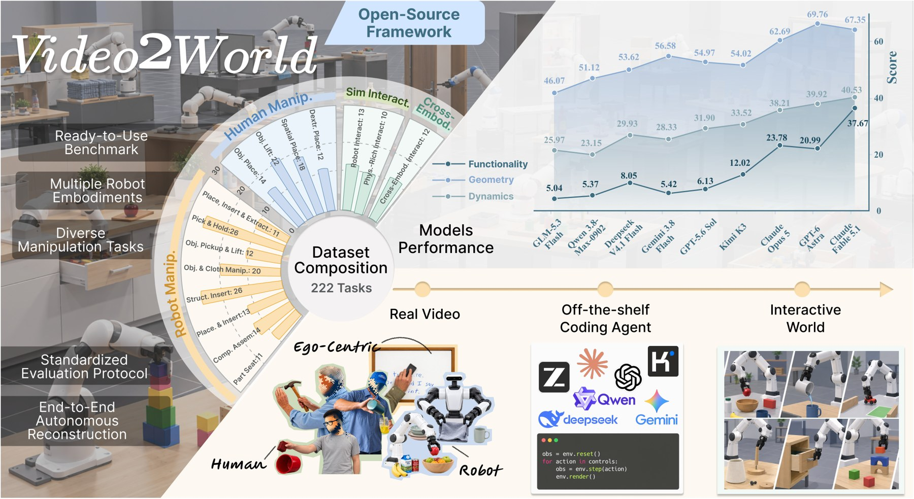

<div align="center">

# Video2World: Benchmarking Coding Agents for Interactive World Modeling from Embodied Videos

**Jinzhou Tang**<sup>1,2*</sup>, **Zijun Zhang**<sup>1*</sup>, Jing Yang<sup>1</sup>, Yuchen Yan<sup>1</sup>, Kun Zhou<sup>1†</sup>,
Lingjun Mao<sup>1</sup>, Ruobing Han<sup>1</sup>, Jinglin Cao<sup>1</sup>, Wenpeng Xu<sup>1</sup>, Lukun He<sup>1</sup>,
Minghao Fu<sup>1,2</sup>, Fan Feng<sup>1</sup>, Biwei Huang<sup>1,2</sup>

<sup>1</sup>Aether AI &nbsp;&nbsp; <sup>2</sup>University of California, San Diego<br>
<sup>*</sup>Equal contribution &nbsp;&nbsp; <sup>†</sup>Corresponding author and project lead

[](https://arxiv.org/abs/2610.04432)
[](https://aetherlabsai.github.io/Video2World)
[](https://huggingface.co/datasets/AetherLabs-AI/Video2World)
[](LICENSE)

</div>

<p align="center">
  
</p>

Building interactive simulators from real-world observations is a promising way to scale embodied data, but current
pipelines still rely heavily on manual environment construction and calibration. **Video2World** asks whether frontier
foundation models and coding agents can automate this process end to end. We formulate *autonomous video-to-simulation*
as a software engineering task: an agent observes an embodied video, constructs the corresponding simulated
environment and robot behavior, and iteratively refines the result through execution feedback.

Video2World comprises **222 reconstruction instances** in **39 task families**, built from **189 video clips** of robot
executions, egocentric human recordings and third-person human demonstrations. Reconstructed worlds are measured along
**geometric fidelity**, **dynamic fidelity** and **functional correctness**, capturing spatial perception, physical
reasoning and executable interaction.

## Overview

Each instance pairs a source video with a target configuration (simulator, robot embodiment, control interface). The
coding agent works in an isolated sandbox with the video, simulator APIs, documentation, assets and general-purpose
coding tools; it receives no scene model, object trajectory, robot state or task specification. The submitted scene and
robot behavior are executed by the evaluator from a fresh initialization, and every change of object state must arise
from simulator dynamics. The rollout is compared with hidden, object-centric annotations:

- **Geometry**: interaction-weighted scene Chamfer distance, object shape Chamfer distance and size error;
- **Dynamics**: translation APE, rotation APE and translation RPE of the object motion produced by the submitted robot
  behavior, against the demonstrated trajectory;
- **Functionality**: task success and stage-wise task progress, judged on object-centric task requirements.

**V2WScore** (0–100) combines build, functionality, geometry and dynamics per instance, macro-averaged over task
families. Every instance also has a **human-assisted reference (HAR)** built with source annotations, tracking, scene
modeling and manual refinement, scored with exactly the same code.

## Installation

Scoring needs only the base package. Evaluation uses three simulator environments, pinned to the versions the
reference results were produced with:

```bash
git clone https://github.com/AetherLabsAI/Video2World.git
cd Video2World
pip install -e .                    # scoring

# ManiSkill / SAPIEN: FurnitureBench, DROID, hand, Push-T
pip install -e .[sim]
python -m mani_skill.utils.download_asset xarm6       # Robotiq gripper meshes

# MuJoCo: rope routing, toy packing, cloth (a separate environment)
python -m venv .venv-twin && .venv-twin/bin/pip install -e .[twin]
v2w setup --twin-python .venv-twin/bin/python

# Isaac Sim 5.1 + Isaac Lab: RoboDojo and in-house (with a RoboDojo checkout at commit 25691aa)
v2w setup --isaac-python /path/to/isaac/python --robodojo-source /path/to/RoboDojo

v2w setup                           # report what is configured
```

`v2w setup` stores these locations in `v2w.local.json`; `--graphics-libs DIR` adds a library directory for headless
Isaac rendering, and Isaac Sim needs GPUs with a working Vulkan device. ManiSkill pulls in the GUI build of OpenCV,
which needs `libGL`; on a headless server without it, install `libgl1` or replace it with the headless build
(`pip uninstall -y opencv-python && pip install --force-reinstall opencv-python-headless`).

## Data

Download the [dataset](https://huggingface.co/datasets/AetherLabs-AI/Video2World) into `./data` (or elsewhere, then
`v2w setup --data PATH`):

```bash
huggingface-cli download AetherLabs-AI/Video2World --repo-type dataset --local-dir data
```

```
data/
  manifest.json                 222 instances with their metric contracts
  samples/<sample>/             video.mp4 (agent input); gt_pkg/, hidden/, meta.json (evaluator only)
  har/<family>/<sample>.json    human-assisted reference results
  sources/  assets/             source annotations, robot models and simulator assets
```

## Usage

Score the human-assisted reference shipped with the data:

```bash
v2w har
```

Run a coding agent on the benchmark, evaluate its submissions and compute V2WScore. Agents are driven through their
command-line interfaces ([Claude Code](https://docs.anthropic.com/en/docs/claude-code),
[Codex](https://github.com/openai/codex), [OpenCode](https://opencode.ai)), so any model those tools can reach can be
evaluated, including self-hosted ones behind an OpenAI-compatible API:

```bash
# Claude Code
v2w run --name opus --agent claude --model claude-opus-5-5 --gpus 0,1 --workers 2

# Codex
v2w run --name astra --agent codex --model gpt-6-astra --reasoning-effort high

# any OpenAI-compatible endpoint (vLLM, SGLang, OpenRouter, DeepSeek, ...), driven by OpenCode
vllm serve Qwen/Qwen3-Coder --port 8000
v2w run --name qwen --base-url http://localhost:8000/v1 --model Qwen/Qwen3-Coder
OPENROUTER_API_KEY=... v2w run --name kimi --base-url https://openrouter.ai/api/v1 \
    --api-key-env OPENROUTER_API_KEY --model moonshotai/kimi-k3

# your own agent (see docs/custom_agent.md)
v2w run --name mine --agent-cmd "my_agent --brief {brief} --video {video} --out {out}"

# packages produced elsewhere, laid out as <family>/<sample>/protocol.json
v2w eval --name submitted --packages /path/to/packages

v2w score --name opus        # runs/opus/report/{summary.json,samples.json,samples.csv}
v2w list                     # task families and instances
```

With `--base-url`, OpenCode is used by default; `--agent codex` uses the Responses API of the endpoint instead. The
agent inspects the video through rendered frames, so the model should accept image input. To evaluate an agent of your
own, follow the tutorial in [docs/custom_agent.md](docs/custom_agent.md).

`--family` and `--sample` restrict a run, and every step is resumable. A submission is a
[video2sim protocol package](video2sim/PROTOCOL.md): `protocol.json` (scene, robot, camera frame, task), the action
stream, meshes and a short report. Agents may use only the video and the task brief of their profile
(`v2w/agents/profiles/`); the bundled driver stages exactly these into an isolated workspace and audits the agent log
for accesses to the hidden annotations. The full evaluation protocol is in [docs/benchmark.md](docs/benchmark.md).

## Repository structure

```
v2w/
  cli.py  runner.py  scoring.py  benchmark.py  paths.py
  agents/      coding-agent driver, task briefs and public task handouts
  metrics/     scene / object geometry, trajectories, task success and progress
  tracks/      evaluators: furniture (FurnitureBench, DROID, Push-T), hand, robodojo, inhouse, twins, cloth
  config/      V2WScore configuration
video2sim/     package protocol, validator, simulation bridges and the agents' self-check tools
docs/          benchmark protocol, custom-agent tutorial
```

## Citation

```bibtex
@article{tang2026video2world,
  title   = {Video2World: Benchmarking Coding Agents for Interactive World Modeling from Embodied Videos},
  author  = {Tang, Jinzhou and Zhang, Zijun and Yang, Jing and Yan, Yuchen and Zhou, Kun and Mao, Lingjun and
             Han, Ruobing and Cao, Jinglin and Xu, Wenpeng and He, Lukun and Fu, Minghao and Feng, Fan and
             Huang, Biwei},
  journal = {arXiv preprint arXiv:2610.04432},
  year    = {2026}
}
```

## Acknowledgements

Video2World builds on the following datasets, simulators, robot models and tools; we thank their authors for making
them available.

- **Video sources and annotations**: [FurnitureBench](https://github.com/clvrai/furniture-bench),
  [DROID](https://droid-dataset.github.io/), [RoboDojo](https://github.com/robodojo-benchmark/RoboDojo),
  [HOI4D](https://hoi4d.github.io/), [HOT3D](https://github.com/facebookresearch/hot3d),
  [DexYCB](https://dex-ycb.github.io/) with the [YCB object set](https://www.ycbbenchmarks.com/), and
  [OakInk2](https://oakink.net/v2/).
- **Reconstructed twins**: [PhysTwin](https://github.com/Jianghanxiao/PhysTwin) and the
  [Real-to-Sim Policy Evaluation](https://huggingface.co/collections/shashuo0104/real-to-sim-policy-eval) twins of
  Push-T, rope routing and toy packing.
- **Simulators**: [ManiSkill 3](https://github.com/haosulab/ManiSkill) and [SAPIEN](https://sapien.ucsd.edu/),
  [MuJoCo](https://github.com/google-deepmind/mujoco), [Isaac Sim / Isaac Lab](https://github.com/isaac-sim/IsaacLab)
  and [Genie Sim](https://github.com/AgibotTech/genie_sim).
- **Robot models**: Franka Panda and Robotiq 2F-85 from the [ManiSkill assets](https://github.com/haosulab/ManiSkill),
  [UFACTORY xArm](https://github.com/xArm-Developer/xarm_ros), [ARX X5](https://github.com/ARXroboticsX/ARX_X5),
  and [Wuji Hand](https://github.com/wuji-technology/wuji-description).
- **In-house household episodes**: the AgiBot G1 with OmniPicker grippers and the household scenes of
  [Genie Sim](https://github.com/AgibotTech/genie_sim) ([assets](https://huggingface.co/datasets/agibot-world/GenieSimAssets)).
- **Coding agents**: [Claude Code](https://github.com/anthropics/claude-code), [Codex](https://github.com/openai/codex)
  and [OpenCode](https://github.com/sst/opencode).
- **Libraries**: [trimesh](https://github.com/mikedh/trimesh), [SciPy](https://scipy.org/),
  [PyTorch Kinematics](https://github.com/UM-ARM-Lab/pytorch_kinematics) and [imageio](https://github.com/imageio/imageio).

## License

Released under the [Apache License 2.0](LICENSE).
